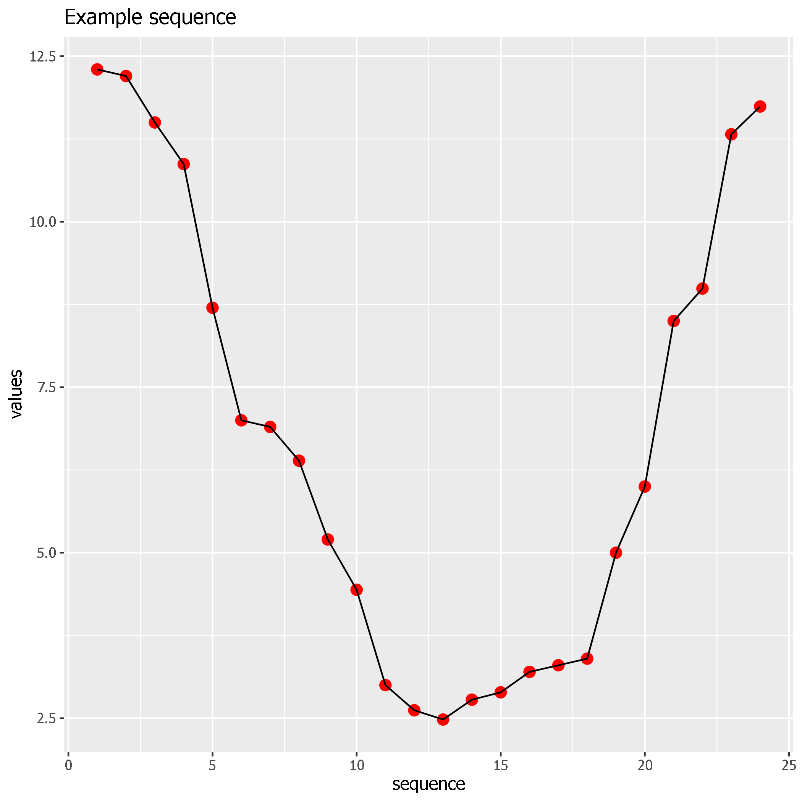

Golden-section search
================
First version developed on 2019-05-26

## Introduction
Implementation of the golden-section search algorithm for **unimodal
sequences**.  
Finds extrema (minimum or maximum).  
Tested with Python 3.7.


## Usage example

``` python
"""Usage example"""
from gss_module.gss import GoldenSectionSearch

unimodal_seq = [12.3, 12.2, 11.499, 10.87, 8.7, 7, 6.9, 6.39,
                5.2, 4.44, 3, 2.62, 2.48, 2.78, 2.891, 3.2, 3.3, 3.4, 5,
                6, 8.5, 8.99, 11.32, 11.74]

f = GoldenSectionSearch()
minimum = f.run(unimodal_seq, True)
print(minimum)

# Returned value:
2.48
```




## Credits:

* https://en.wikipedia.org/wiki/Unimodality
* https://en.wikipedia.org/wiki/Golden-section_search
* https://math.stackexchange.com/questions/80225/efficient-algorithm-to-find-maximum-of-a-unimodal-sequence
* http://mathforcollege.com/nm/mws/gen/09opt/mws_gen_opt_txt_goldensearch.pdf
